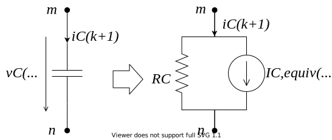

## EMT Equations and Modified Nodal Analysis

### Inductance

An inductance is described by
$$
  v_j(t) - v_k(t) = v_L(t) = L \frac{\mathrm{d} i_L(t)}{\mathrm{d}t}
$$
Integration results in an equation to compute the current at time $t$ from a previous state at $t - \Delta t$.
$$
  i_L(t) = i_L(t - \Delta t) + \frac{1}{L} \ \int_{t - \Delta t}^{t} v_L(\tau) \ \mathrm{d} \tau
$$
There are various methods to discretize this equation in order to solve it numerically.
The trapezoidal rule, an implicit second-order method, is commonly applied for circuit simulation:
$$
	\int_{t - \Delta t}^{t} f(\tau) \ \mathrm{d} \tau \approx \frac{\Delta t}{2}(f(t) + f(t - \Delta t))
$$
Applying the trapezoidal rule to leads to
$$
	i_L(t) = i_L(t - \Delta t) + \frac{\Delta t}{2L}(v_L(t) + v_L(t - \Delta t))
$$
This can be rewritten in terms of an equivalent conductance and current source and the number of time steps $k$ with size $\Delta t$.
$$
	i_L(k) = g_L v_L(k) + i_{L,equiv}(k-1)
$$
$$
	i_{L,equiv}(k-1) = i_L(k-1) + \frac{\Delta t}{2L} v_L(k-1)
$$
$$
	g_L = \frac{\Delta t}{2L}
$$

Hence, components described by differential equations are transformed into a DC equivalent circuit as depicted in the figure below.


### Capacitance

The same procedure can be applied to a capacitance.
Integration on both side yields
$$
	i_C(t) = C \frac{\mathrm{d}}{\mathrm{d}t} \ v_C(t)
$$
$$
	v_C(t) = v_C(t - \Delta t) + \frac{1}{C} \int_{t - \Delta t}^t i_C(\tau) \mathrm{d} \tau
$$
Finally, the equivalent circuit is described by a current source and a conductance.
$$
	i_{C}(k) = g_{C} v_C(k) + i_{C,equiv}(k-1)
$$
$$
	i_{C,equiv}(k-1) = -i_{C}(k-1) - g_C v_C(k-1)
$$
$$
	g_{C} = \frac{2C}{\Delta t}
$$
This equation set is visualized in the figure below.



Hence, the vector of unknowns $\bm{x}$ and the source vector $\bm{b}$ become time dependent and this leads to the system description:
$$
	\bm{A} \bm{x}(t) = \bm{b}(t)
$$
To simulate the transient behavior of circuits, this linear equation has to be solved repeatedly.
As long as the system topology and the time step is fixed, the system matrix is constant.

## Extension with Dynamic Phasors

The dynamic phasor concept can be integrated with nodal analysis.
The overall procedure does not change but the system equations are rewritten using complex numbers and all variables need to be expressed in terms of dynamic phasors.
Therefore, the resistive companion representations of inductances and capacitances have to be adapted as well.

### Inductance
In dynamic phasors the integration of the inductance equation yields
```math
\begin{align}
\langle v_L \rangle(t)  &= \Big \langle L \frac{\mathrm{d} i_L}{\mathrm{d}t} \Big \rangle(t) \nonumber \\
                        &= L \frac{\mathrm{d}}{dt} \langle i_L \rangle(t) + j \omega L \ \langle i_L \rangle(t)
\end{align}
```

$$
  \langle i_L \rangle(t) = \langle i_L \rangle(t - \Delta t) + \int_{t - \Delta t}^t \frac{1}{L} \langle v_L \rangle(\tau) - j \omega \ \langle i_L \rangle(\tau) \mathrm{d} \tau
$$

Applying the trapezoidal method leads to the finite difference equation:
$$
\begin{split}
	\langle i_L \rangle(k) = \langle i_L \rangle(k-1) + \frac{\Delta t}{2} \bigg[ \frac{1}{L} (\langle v_L \rangle(k) + \langle v_L \rangle(k-1))
	- j \omega (\langle i_L \rangle(t) + \langle i_L \rangle(k-1) \bigg]
\end{split}
$$

Solving this for $\langle i_L \rangle(k)$ results in the \ac{DP} equivalent circuit model:
$$
	\langle i_L \rangle(k) = \frac{a - jab}{1 + b^2} \langle v_L \rangle(k) + \langle i_{L,equiv} \rangle(k-1)
$$
with
$$
	a = \frac{\Delta t}{2L}, \qquad b = \frac{\Delta t \omega}{2}
$$
$$
	\langle i_{L,equiv} \rangle(k-1) = \frac{1 - b^2 - j2b}{1 + b^2} \langle i_L \rangle(k-1) + \frac{a - jab}{1 + b^2} \langle v_L \rangle(k-1)
$$

### Capacitance

Similarly, a capacitance is described by as follows
$$
  \langle i_C \rangle(k) = C \ \frac{\mathrm{d} \langle v_C \rangle}{\mathrm{d} t} + j \omega C \ \langle v_C \rangle(t)
$$
$$
  v_C(t) = v_C(t- \Delta t) + \int_{t- \Delta t}^{t} \frac{1}{C} \ i_C(\tau) -j \omega \ v_C(\tau) \ \mathrm{d} \tau
$$

Applying the trapezoidal rule for the capacitance equation leads to the finite difference equation:
```math
\begin{split}
  \langle v_C \rangle(k) = \langle v_C \rangle(k-1)
  + \frac{\Delta t}{2} \bigg[ \frac{1}{C} \ \langle i_C \rangle(k) - j \omega \ \langle v_C \rangle(k) \\
  + \frac{1}{C} \ \langle i_C \rangle(k-1) - j \omega \ \langle v_C \rangle(k-1) \bigg]
 \end{split}
```

The DP model for the capacitance is defined by
$$
  \langle i_C \rangle(k) = \frac{1+jb}{a} \ \langle v_C \rangle(k) + \langle i_{C,equiv} \rangle(k-1)
$$
with
$$
  a = \frac{\Delta t}{2C}, \qquad
  b = \frac{\Delta t \omega}{2}
$$
$$
	\langle i_{C,equiv} \rangle(k-1) = - \frac{1-jb}{a} \ \langle v_C \rangle(k-1) - \langle i_C \rangle(k-1)
$$

### RL-series element

In dynamic phasors the integration of the inductance equation yields
$$
  \langle v \rangle(t) = L \frac{\mathrm{d}}{dt} \langle i \rangle(t) + j \omega L \ \langle i \rangle(t) + R \ \langle i \rangle(t)
$$
$$
  \langle i \rangle(t) = \langle i \rangle(t - \Delta t) + \int_{t - \Delta t}^t \frac{1}{L} \langle v \rangle(\tau) - j \omega \ \langle i \rangle(\tau) - \frac{R}{L} \ \langle i \rangle(\tau) \mathrm{d} \tau
$$

Applying the trapezoidal method leads to the finite difference equation:
$$
\begin{split}
	\langle i \rangle(k) = \langle i \rangle(k-1) + \frac{\Delta t}{2} \bigg[ \frac{1}{L} (\langle v \rangle(k) + \langle v \rangle(k-1))
	- \left( j \omega + \frac{R}{L} \right) (\langle i \rangle(k) + \langle i \rangle(k-1)) \bigg]
\end{split}
$$

Solving this for $\langle i \rangle(k)$ results in the \ac{DP} equivalent circuit model:
$$
	\langle i \rangle(k) = \frac{a + Ra^2 - jab}{(1+Ra)^2 + b^2} \langle v \rangle(k) + \langle i_{equiv} \rangle(k-1)
$$
with
$$
	a = \frac{\Delta t}{2L}, \qquad b = \frac{\Delta t \omega}{2}
$$
$$
	\langle i_{equiv} \rangle(k-1) = \frac{1 - b^2 - j2b + 2Ra + (Ra)^2 - j2Rab}{(1+Ra^2) + b^2} \langle i \rangle(k-1) + \frac{a + Ra^2 - jab}{(1+Ra)^2 + b^2} \langle v \rangle(k-1)
$$
